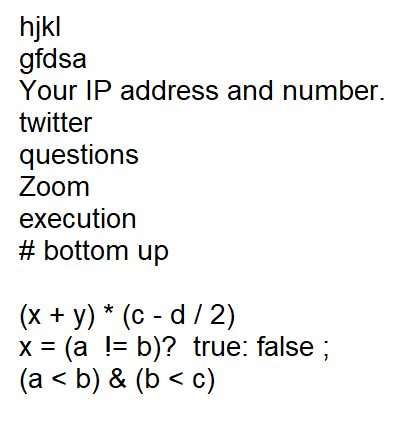

# 演習2回目の課題

まずは、このファイルが見えるところまで来ましたね。

以下は、Gitpod 上で、このファイルを開いていることを前提に進めます。

## ファイルのダウンロード

1. このファイル(`kadai.md`)を 左の Sidebar から選んで、右クリック、ポップアップメニューから`Download` を選びましょう。
2. 皆さんの環境によっては、`.md` の部分（拡張子と呼ばれる）が見えなくなるかもしれません。
  * 表示したい場合は、`windows 拡張子 表示` とか `mac 拡張子 表示`とかで検索しましょう！

## テキストファイルの作成

`2kaime` directory (folder) に `input.txt` というファイルを作成しましょう。

1. `2kaime` directory (folder) を選択して、右クリックで `New File` を選んでファイル名を指定しておしまい
    * `操作の前に注意`: 新しいファイルを作成したら、画面右側の Editor 画面は、新しいファイルを表示するようになります。Editor 上部のタブで画面選択できますので、`kadai.md` を選びましょう。

## 文字入力してみましょう

画面下部に画像が出ている場合は、その内容を`input.txt` に入力しましょう。
あるいは、`2kaime` 下の `characters.png` をクリックすると、中身を表示できます。

そう、二つの画面を同時に表示できないと作業できないことに気づくでしょう？

そんなときは、画面切り替えにつかった`タブ`を drag & drop 操作（マウスボタンを押した状態で移動してからリリース）で、画面右端や画面下側に移動してみるとよいでしょう。タブが移動したかと思います。

これで、二つのファイルを見ながら作業できるようになりましたね。

さて、あとは画像をみながら、文字入力すればいいだけです。簡単なものにしています。

`注`: ある程度書いたら、`ファイルを保存(save)`しましょう。画面上側のFileメニューからSave を選んでもいいですが、`Control` キーを押しながら `S` キー（もしかしたら環境によって違うキーの可能性があります）を押すだけでもファイルが保存できるかと。
こういうのは、ショートカットキーといいます。
ショートカット情報は、メニューを選択する際右側に表示されていたりするので、よく使うものは覚えておきましょう。

この文書の作者（鎌田）は、ショートカットキーを覚え、マウスやリターンキーに指を伸ばす必要がなくなってから、タッチタイピングができるようになりました。余談ですね。

で、タイピングが苦手な人は、課題はサクッと提出して、その後、地道にタイピングの練習しておきましょう。
検索したらタイピングゲームとか色々あるので、まあそんなの使えばよいかと。

## おまけ

実は、このファイルは markdown とよばれるフォーマットで書かれています。
このフォーマットは、hyperlink や画像なども表示できるフォーマットです。

`kadai.md` ファイルを開く際、クリックの代わりに、右クリックして`Open With Preview` を選ぶと、少し小ぎれいな画面で見えるようになったかと。
最近よく使われているフォーマットなので、興味ある人は見ておくとよいでしょう。

